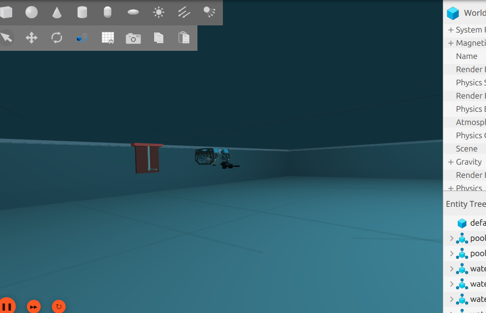
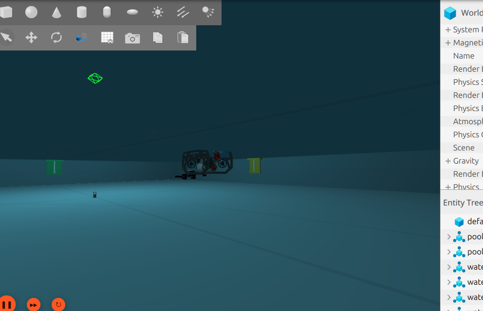
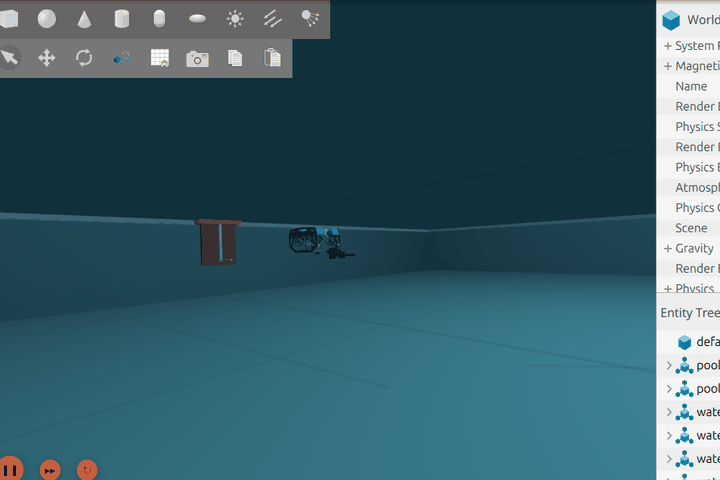

# WS_ROV — Workspace Simulasi ROV Gamantaray (KKI 2026)

`WS_ROV` adalah workspace simulasi underwater **ROS 2 Jazzy** dan **Gazebo Harmonic** untuk menguji serta mengendalikan kapal selam **ROV Gamantaray** pada arena kolam Kontes Kapal Cepat Indonesia (KKI) 2026. Workspace ini dirancang sebagai platform latihan terpadu untuk pengujian manuver 6-DOF, pengoperasian manipulator arm (capit/gripper), pembacaan QR code payload, dan navigasi penempatan payload ke target hook.

---

## Gambaran Umum Workspace

Workspace simulasi ini mengintegrasikan seluruh subsistem ROV secara modular:

- **Model Fisik & Visual 3D**: Model ROV bergaya BlueROV2 dengan kerangka aluminium, 6 propeller T200, dome kamera HD, lampu LED illumination, serta capit/gripper di bagian depan bawah.
- **Arena Kolam KKI**: Kolam berukuran ~10 m × 10 m dengan kedalaman representatif, marka dasar kolam, dinding perimeter, payload ber-QR code (Payload A/B/C/D), dan hook target berwarna.
- **Efek Lingkungan Air**: Simulasi visual air, riak permukaan (*wavefield*), transmisi cahaya underwater (*caustics*), gelembung thruster, serta tether visual yang terhubung ke permukaan.
- **Kontrol & Teleoperasi**: Pengendalian manual menggunakan joystick (Xbox/Gamepad) maupun keyboard dengan kinematic movement default dan mode hydrodynamics eksperimental.

---

## Galeri Visual & Demonstrasi Animasi (Gazebo Sim)

Berikut adalah screenshot dan rekaman animated GIF dari sudut pandang underwater yang diambil langsung dari lingkungan simulasi Gazebo Sim `WS_ROV`:

### 1. Tampilan Dekat Kapal Selam (Close-up ROV Gamantaray)


*Close-up ROV Gamantaray dari sudut pandang underwater: Memperlihatkan kerangka utama, konfigurasi 6 thruster T200, dome kamera, lampu illumination, dan mekanisme capit/gripper di bagian depan bawah.*

---

### 2. Tampilan Samping & Arena Underwater


*Tampilan underwater arena: Area latihan kolam indoor KKI diambil dari sudut pandang bawah air dekat dengan kapal selam dan platform payload.*

---

### 3. Demonstrasi Manuver Lengkap Kapal Selam (Ke Atas/Bawah, Kesamping, & Capit)


*Animasi Manuver Terpadu ROV Gamantaray (Gazebo Sim): Memperlihatkan seluruh manuver kapal selam secara lengkap dalam satu GIF (menyelam ke dasar & naik kembali, gerak strafing kesamping kiri/kanan, pengoperasian buka-tutup capit/gripper, serta rotasi 6-DOF).*

---

## Fitur & Spesifikasi Sub-Sistem

| Sub-sistem | Deskripsi & Kemampuan |
| --- | --- |
| **Sistem Propulsion** | 6 Thruster T200 dengan alokasi matriks thruster (`thruster_allocator`) untuk kontrol 6-DOF. |
| **Manipulator Arm (Capit)** | Capit/gripper pneumatik/servo dengan feedback jarak dan logika penguncian payload (*magnetic/funnel capture*). |
| **Sistem Vision** | Kamera Depan (wall view) & Kamera Bawah (bottom view) terintegrasi node OpenCV QR Detector (`rov_gamantaray_vision`). |
| **Kabel Tether Visual** | Simulasi kabel tether multi-segmen fleksibel yang mengikuti pergerakan ROV dari deck anchor. |
| **Mission Supervisor** | Autonomous/assisted state machine untuk misi pengenalan QR code dan peletakan payload pada hook KKI. |

---

## Varian Model ROV

Workspace menyediakan beberapa pilihan varian ROV yang dapat dipilih saat launch dengan argumen `rov_variant:=<varian>`:

| Varian | Deskripsi |
| --- | --- |
| `github_blue` **(Default)** | Body BlueROV2-style, 6 thruster T200, dome kamera, dan gripper compact terintegrasi. |
| `github_blue_joint` | Varian dengan artikulasi joint visual capit yang sama untuk pengujian alur misi. |
| `github_blue_joint_experimental` | Eksperimen contact solver Gazebo pada rahang capit gripper. |
| `beaumont` | Pembanding model Beaumont underwater. |
| `bluerov` | Pembanding model BlueROV2 standar. |

---

## Struktur Paket Workspace

```text
WS_ROV/
├── docs/                        # Dokumentasi teknis & panduan operasional
│   └── images/                  # Screenshot & GIF animasi Gazebo Sim
├── src/                         # Paket-paket ROS 2 ROV
│   ├── rov_gamantaray_bringup/   # Launch file utama (kki_rov_sim.launch.py)
│   ├── rov_gamantaray_control/   # Node teleop, thruster allocator, gripper manager, dashboard
│   ├── rov_gamantaray_description/# Model URDF/SDF ROV, mesh 3D, dan deskripsi robot
│   ├── rov_gamantaray_gazebo/    # SDF World kolam KKI & plugin lingkungan air
│   ├── rov_gamantaray_hardware/  # Driver komunikasi serial/PWM untuk ROV fisik
│   └── rov_gamantaray_vision/    # Node pengolah gambar & QR Code detector
├── setup_asli_ROV/              # Kode ground station & onboard untuk ROV asli (hardware)
└── tools/                       # Skrip bantu dan perekam aset Gazebo
```

---

## Panduan Memulai Cepat

### 1. Build Workspace

```bash
cd /home/ammar/Documents/WS_ROV
source /opt/ros/jazzy/setup.bash
colcon build --symlink-install
source install/setup.bash
```

### 2. Jalankan Simulasi Gazebo (Dengan Joystick Xbox/Gamepad)

```bash
ros2 launch rov_gamantaray_bringup kki_rov_sim.launch.py joystick:=true joystick_device:=/dev/input/js0
```

### 3. Kontrol Manual Joystick

- **Left Stick (Atas/Bawah)**: Maju / Mundur (*Surge*)
- **Left Stick (Kiri/Kanan)**: Geser Kiri / Kanan (*Sway*)
- **Right Stick (Atas/Bawah)**: Naik / Turun (*Heave*)
- **Right Stick (Kiri/Kanan)**: Yaw Kiri / Kanan (*Yaw*)
- **Tombol A**: Tutup Capit / Gripper
- **Tombol B**: Buka Capit / Gripper

---

## Dokumentasi Terkait

- [Panduan Cara Menjalankan Workspace](docs/cara_menjalankan_workspace.md)
- [Logika & Metode Workspace ROV](docs/metode_dan_logika_workspace.md)
- [Kesesuaian Dengan Misi KKI 2026](docs/kki_mission_alignment.md)
- [Validasi & Catatan Simulasi](docs/validation_notes.md)
- [Panduan Migrasi Ke ROV Nyata](docs/migrasi_ke_sistem_nyata.md)

---

## Lisensi

Workspace ini dikembangkan untuk simulasi dan latihan tim ROV Gamantaray Universitas Gadjah Mada (UGM). Aset 3D dan komponen referensi mengikuti lisensi asal masing-masing (lihat `docs/reused_references.md`).
